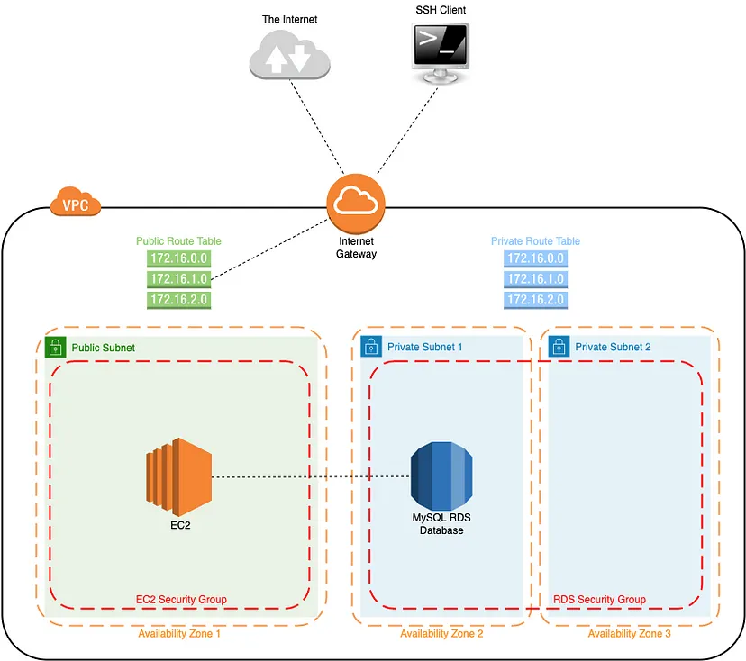

# Create custom VPC with EC2 and RDS Instance using Terraform

## Overview

This project aims to provision and manage EC2 instances and RDS databases using Terraform. It provides an infrastructure-as-code solution for deploying and maintaining the required resources on a cloud provider.

## Features

- Infrastructure provisioning using Terraform
- EC2 instance creation and configuration
- RDS database creation and configuration
- Network setup and security group management
- Scalability and high availability considerations

## Architectures



## Prerequisites

Before getting started, make sure you have the following:

- Terraform installed on your local machine
- AWS account credentials with appropriate permissions
- Basic knowledge of Terraform and AWS services

## Getting Started

To get started with this project, follow these steps:

1. Clone this repository:
```
git clone https://github.com/iamphanan13/VPC-EC2-RDS-Instance.git`
```

2. Configure your AWS credentials.
```
export AWS_ACCESS_KEY_ID=<Your AWS Acess ID>
export AWS_SECRET_ACCESS_KEY=<your AWS Secret Acess Key>
```
3. Update your value in `variables/secrets.tfvars`

```
db_username = "username" // Add your username
db_password = "Password123!" // Add your password

my_ip = "xxx.xxx.xx.x" // Update your IP Address
```

4. Update the Terraform variables in the configuration files as needed.
4. Run `terraform init` to initialize the project.
5. Run `
terraform plan --var-file="variables/secrets.tfvars" ` to see the planned changes.

6. Run `terraform apply --var-file="variables/secrets.tfvars"` to provision the infrastructure.
7. Verify that the EC2 instances and RDS databases are successfully created.

8. Change permission of private key
```
chmod 400 ec2_kp.pem
```
9. Let's connect to EC2 Instance, if they asked something, please type `yes`.
```
ssh -o 'IdentitiesOnly yes' -i "ec2_kp.pem" ubuntu@$(terraform output -raw public_dns)
```

10. Updated Ubuntu packages and install mysql client
```
sudo apt-get update -y && sudo apt install mysql-client -y
```

11. Let's connect to `MySQL`
```
mysql -h <database-endpoint> -P <database-port> -u <db-username> -p <db-password>
```

12. Enjoy

**Reminder**: After you have done everything, please run `terraform destroy --auto-approve`.

## Contributing

Contributions are welcome! If you find any issues or have suggestions for improvements, please open an issue or submit a pull request.

## License

This project is licensed under the [MIT License](LICENSE).